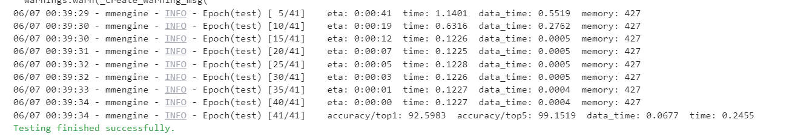

## 第二次作业供大家参考：

### 前言
- 本次作业上交的文件要包含**配置文件（config.py文件）、训练日志（json或log文件）、验证集评估指标、预测结果图**

- 最主要是验证集集评估指标以及预测图，最好将评估指标和预测图贴在readme.md中。

- 但如果没有上传其他相关训练、日志文件作为依据，只有如下评估指标和预测图无法确定是你本人做的；

- 文件说明：

  - 配置文件见:[resnet50_fruit30.py](mmpretrain/myconfig/resnet50_fruit30.py)

  - 训练日志见:[20230606_153206.log](mmpretrain/work_dirs/20230606_153206/20230606_153206.log)

  - 验证集评估日志见:[20230607_003915.log](mmpretrain/work_dirs/resnet50_fruit30/20230607_003915/20230607_003915.log)  
  
---

### resnet50（epoch=10）:

- 验证集评估指标如下：

  

- 预测图片结果如下：

  
  
  
  
