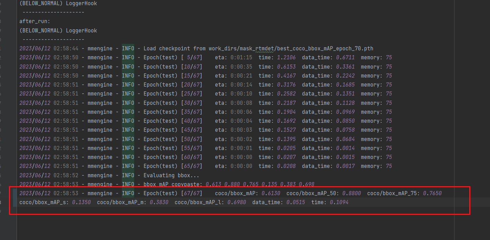
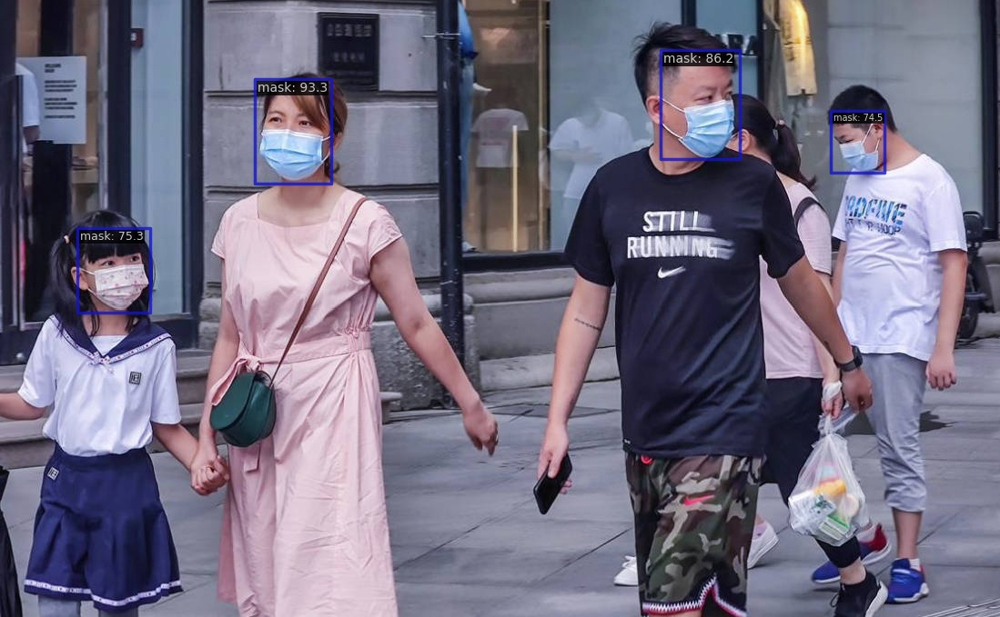
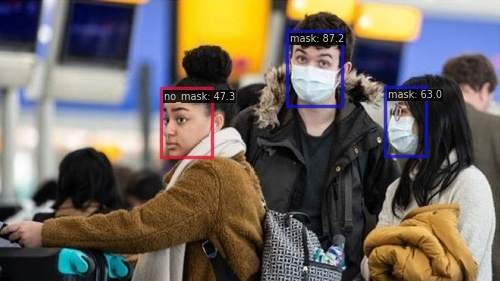

# 基于RTMDet的口罩检测

### 📂文件说明：
- [mmdetection源码文件夹：mmdetection/](mmdetection/)
- [数据集预处理脚本文件夹：script/](script/)
- [可视化数据集：0-visual_dataset.ipynb](0-visual_dataset.ipynb)
- [训练脚本：1-train.ipynb](1-train.ipynb)
- [测试脚本：2-test.ipynb](2-test.ipynb)
- [预测图片：3-pre_img.ipynb](3-pre_img.ipynb)
- [预测视频：4-pre_video.ipynb](4-pre_video.ipynb)
- [预测摄像头：5-pre_cap.ipynb](5-pre_cap.ipynb)
---

### 😀评估指标及预测效果:

#### 验证集评估指标：

#### 预测图片：

#### 预测视频：

#### 预测摄像头：
预计效果和视频差不多，由于开发均在服务器，无法预测摄像头

   

  