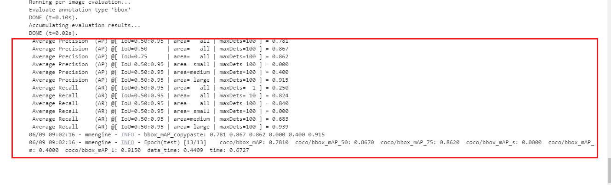

## 第三次作业供大家参考：

### 前言
- 本次作业上交的文件要包含**配置文件、训练日志、验证集评估指标、预测结果图、可视化分析图**

- **并将验证集评估指标、预测图、可视化分析图贴在readme.md中**。

- 如果没有上传其他相关训练、日志文件作为依据，只有评估指标和预测图无法确定是你本人做的；

- 文件说明：

  - 配置文件见:[balloon_rtmdet.py](mmdetection/balloon_dataset/balloon_rtmdet.py)

  - 训练日志见:[20230609_084703.log](mmdetection/work_dirs/balloon_rtmdet/20230609_084703/20230609_084703.log)

  - 验证集评估日志见:[20230609_090157.log](mmdetection/work_dirs/balloon_rtmdet/20230609_090157/20230609_090157.log)  
  
---

### rtmdet（详细见配置文件）:

- 验证集评估指标：

  

- 预测图片：

  

- 可视化分析：
   
  
  
  [更多见7-visual_analyze.ipynb记录](7-visual_analyze.ipynb)

  