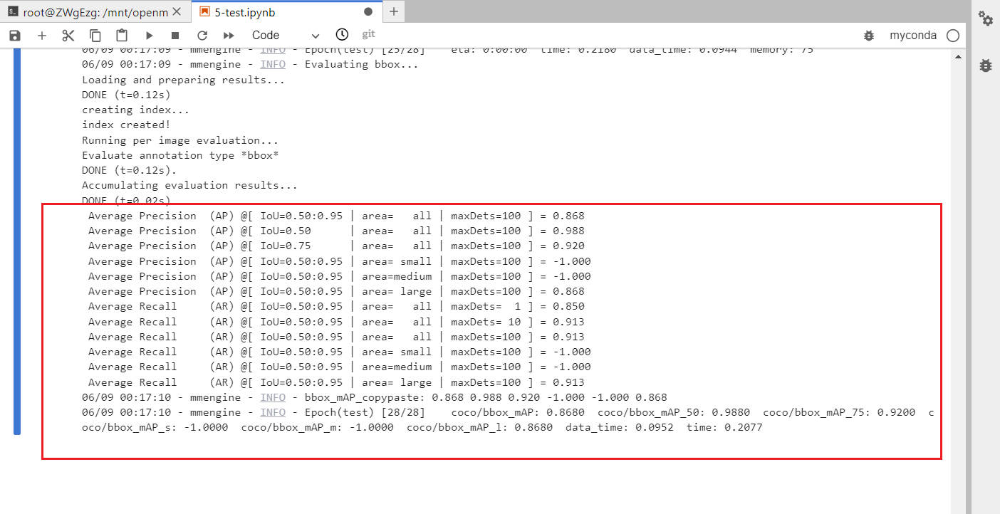
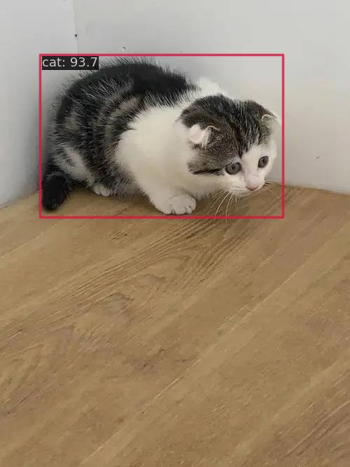

# 使用rtmdet训练自定义数据集

## 说明

- 训练日志见：[20230608_152312.log](mmdetection/work_dirs/cat_rtmdet_config/20230608_152312/20230608_152312.log)
- 测试集评估日志：[20230609_001652.log](mmdetection/work_dirs/cat_rtmdet_config/20230609_001652/20230609_001652.log)

## rtmdet

测试集评估指标：

预测图片：

