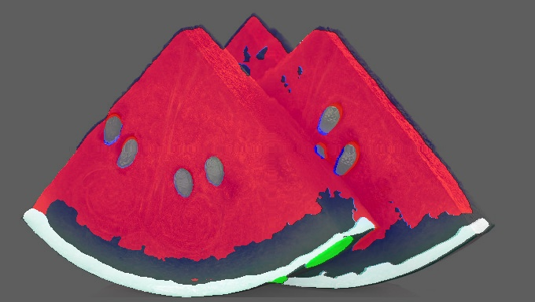

## 第四次作业供大家参考：

### 前言
- 本次作业上交的文件要包含**配置文件、训练日志、测试集评估指标、预测结果图、预测视频**

- **并将验证集评估指标、预测图贴在readme.md中**。

- 如果没有上传其他相关训练、日志文件作为依据，只有评估指标和预测图无法确定是你本人做的；

- 文件说明：

  - 配置文件见:[pspnet-watermelon.py](mmsegmentation/Watermelon87_Semantic_Seg_Mask/pspnet-watermelon.py)

  - 训练日志见:[20230614_023254.log](mmsegmentation/work_dirs/pspnet-watermelon/20230614_023254/20230614_023254.log)

  - 测试日志见:[20230614_043255.log](mmsegmentation/work_dirs/pspnet-watermelon/20230614_043255/20230614_043255.log)  
  
---

### PSPNet

- 验证集评估指标：
```bash
warnings.warn(_create_warning_msg(
06/14 04:33:47 - mmengine - INFO - per class results:
06/14 04:33:47 - mmengine - INFO - 
+------------+-------+-------+
|   Class    |  IoU  |  Acc  |
+------------+-------+-------+
| Unlabeled  | 77.85 | 96.24 |
|    red     | 69.01 | 72.61 |
|   green    | 31.89 | 36.93 |
|   white    | 59.67 | 61.72 |
| seed-black | 57.69 | 72.31 |
| seed-white |  4.36 |  4.36 |
+------------+-------+-------+
06/14 04:33:47 - mmengine - INFO - Iter(test) [11/11]    aAcc: 83.2300  mIoU: 50.0800  mAcc: 57.3600  data_time: 0.1370  time: 4.0217

```
- 原图：

  
  
- 预测图片：

  

- 预测视频：


   
### Segformer
敬请期待...


  